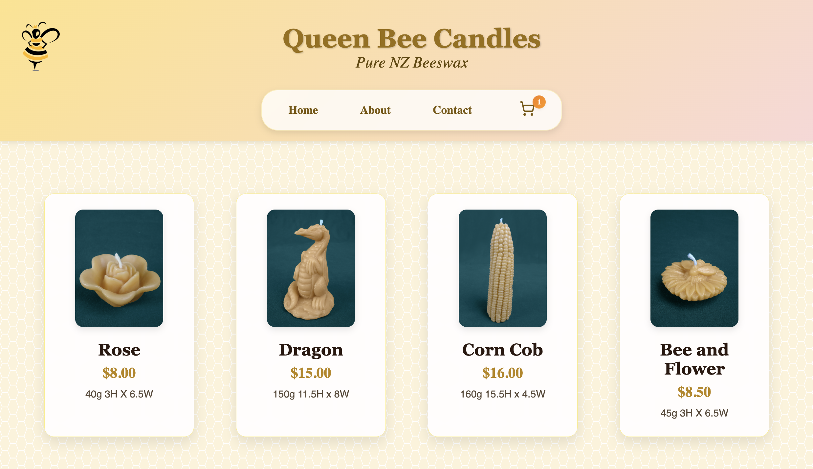
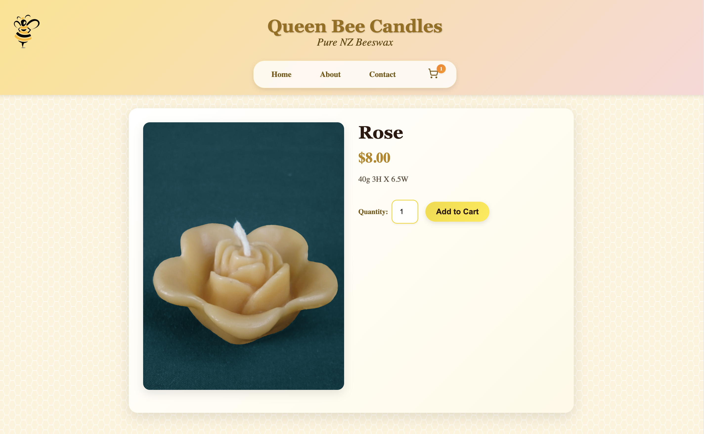
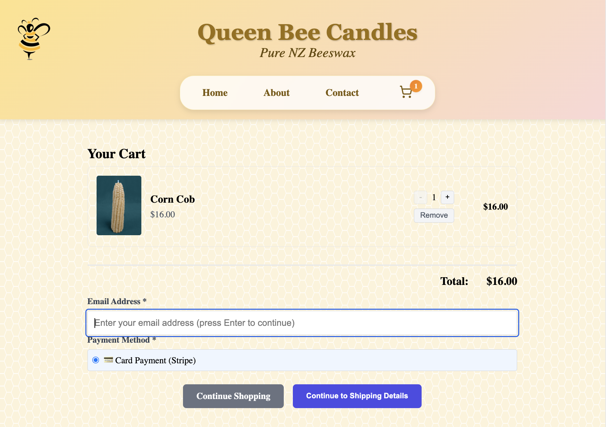
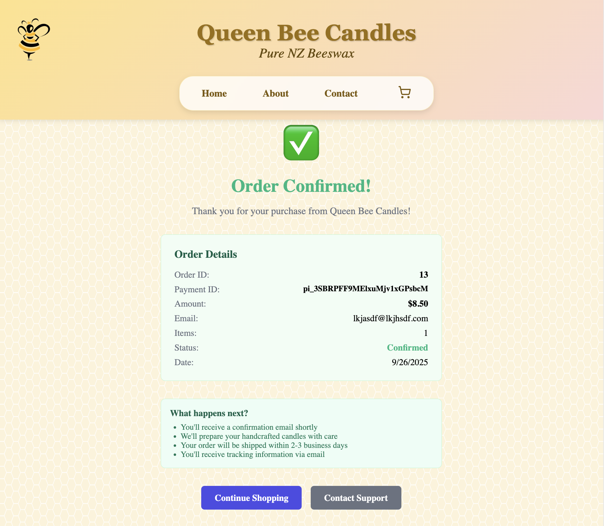
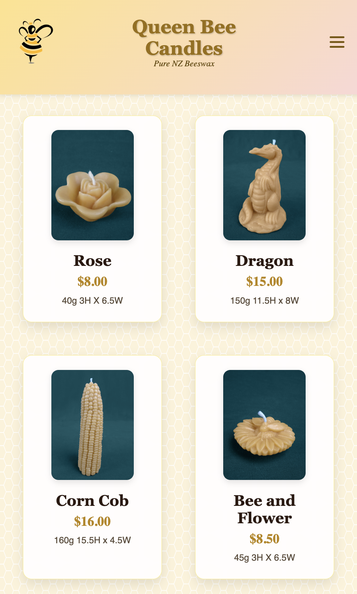

# E-Commerce Platform 🛍️

A professional full-stack e-commerce application showcasing modern web development practices and enterprise-grade architecture. This template demonstrates complete product lifecycle management - from browsing products to secure payment processing.

**Note**: This is a working e-commerce template that can be customized for any online retail business. All branding and product-specific references can be easily adapted to your needs.

## 🎯 Overview

This full-stack application demonstrates complete e-commerce functionality with React, Node.js, PostgreSQL, and Stripe integration.

**Live Features**: Product catalog, shopping cart with sidebar quick-edit, secure checkout, order management, inventory tracking, and customer contact form with email notifications.

## 📸 Screenshots

<div align="center">

### Homepage & Product Gallery



_Professional product display with responsive grid layout_

### Product Detail & Shopping Cart

 

_Individual product views and intuitive cart management_

### Secure Checkout Process



_Professional payment processing with Stripe integration_

### Mobile Responsive Design



_Seamless experience across all devices_

</div>

---

## 🏆 Key Highlights

### **Business Value**

- **Enhanced Shopping Experience**: Cart sidebar for quick edits without losing checkout progress
- **Secure Payment Processing**: Full Stripe integration with webhook validation
- **Production Ready**: PostgreSQL database, automated testing, CI/CD pipeline
- **Accessible Design**: WCAG compliance improvements for inclusive user experience
- **Mobile Optimized**: Responsive design across all devices

### **Technical Excellence**

- **Comprehensive Testing**: Automated test suites for reliability and maintainability
- **Security First**: Input validation, rate limiting, CORS protection, secure credential management
- **Performance Optimized**: Efficient database queries, optimized bundles, error boundaries
- **Professional Code**: Clean architecture, consistent patterns, comprehensive documentation

### **Modern Stack**

- **Frontend**: React, React Router, Context API, Stripe Elements
- **Backend**: Node.js, Express, PostgreSQL, Stripe webhook handling
- **DevOps**: GitHub Actions CI/CD, Docker containerization, automated testing
- **Accessibility**: ARIA labels, keyboard navigation, screen reader support

---

## 🚀 Quick Start

```bash
# Start PostgreSQL and pgAdmin with Docker Compose
docker-compose up -d postgres pgadmin

# Server setup
cd server && npm install && npm run dev

# Client setup (in new terminal)
cd client && npm install && npm run dev
```

**Prerequisites**: Node.js 18+, Docker, Stripe account

**Access**: 
- Frontend: http://localhost:3000
- Backend API: http://localhost:8080
- pgAdmin: http://localhost:8081

---

## 🛠️ Customization Guide

### **Adapting for Your Business**

This application is designed to be easily customized for any e-commerce use case:

**Product Configuration:**

- Update `server/data/products.json` with your product catalog
- Replace product images in `server/public/images/`
- Modify product categories in `ProductsAPI.js`

**Branding & Styling:**

- Update company name, colors, and fonts in `client/src/styles/`
- Replace logo and branding assets
- Customize email templates in `server/controllers/ContactController.js`

**Payment & Business Logic:**

- Configure your Stripe keys in environment variables
- Adjust tax rates and shipping logic in `OrderService.js`
- Customize order confirmation emails

**Environment Setup:**

```bash
# Copy example environment files
cp server/.env.example server/.env
cp client/.env.example client/.env

# Configure your specific values
# Database connection, Stripe keys, email settings, etc.
```

**Database Customization:**

- Modify database schema in `server/database/`
- Add custom product fields or order attributes
- Update API endpoints to match your data structure

---

## 🧪 Quality Assurance

- **Full Test Coverage**: Server and client test suites with automated CI/CD validation
- **Accessibility Testing**: Automated compliance checks with axe-core integration
- **Security Validation**: Input sanitization, rate limiting, secure payment processing
- **Performance Monitoring**: Optimized queries, efficient rendering, error tracking

---

## 💼 Why This Matters

This project demonstrates **reliable, scalable, and maintainable** software architecture. From secure payment processing to accessibility compliance, every aspect reflects enterprise-level development practices.

**Perfect for**: E-commerce platforms, small business websites, or any application requiring secure transactions and professional user experience.

---

## 📱 API Endpoints

- `GET /api/products` - Product catalog
- `POST /api/orders` - Order management
- `POST /api/stripe/*` - Payment processing
- `POST /api/contact` - Contact form submission
- `POST /api/shipping/calculate` - Calculate shipping rates
- `GET /api/shipping/test` - Shipping service health check
- `GET /images/*` - Static asset delivery

---

## 📚 Documentation

- **[CLAUDE.md](CLAUDE.md)** - Complete project context for AI assistants
- **[ARCHITECTURE.md](ARCHITECTURE.md)** - System architecture and design decisions
- **[API.md](API.md)** - Comprehensive API documentation
- **[DEPLOYMENT.md](DEPLOYMENT.md)** - Production deployment guide
- **[CHANGELOG.md](CHANGELOG.md)** - Version history and release notes
- **[DEV-SETUP.md](DEV-SETUP.md)** - Development environment setup
- **[.env.example](server/.env.example)** - Environment configuration templates

---

_Showcasing professional web development with modern technologies, comprehensive testing, and production-ready architecture._
